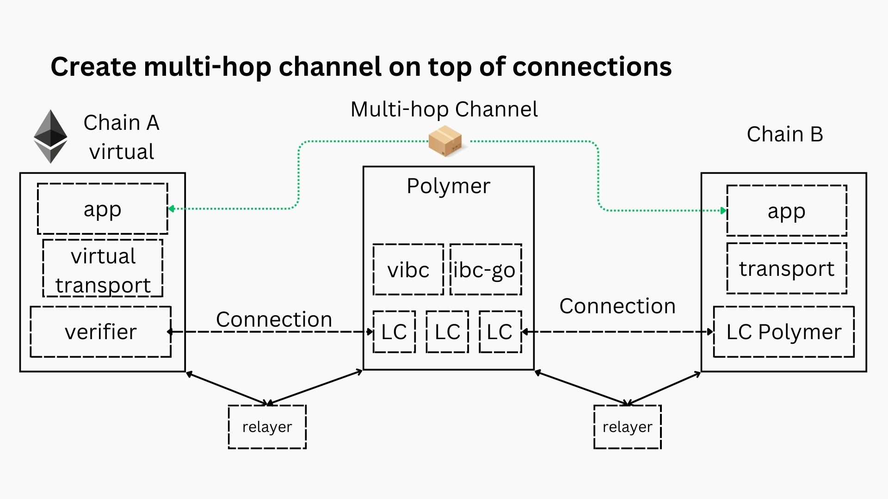

### Navigate

[Previous](./index.md) / [Go back HOME](../index.md) / Next

# Quickstart tutorial: race to send packets

The claim made for IBC SDK is that it makes the cross-chain dapp developer's life much easier by automating a lot the tasks normally executed by the developer just to set up the testing environment.

But we believe in the _show, don't tell_ philosophy, so we don't expect you to just take our word for it. Let's showcase with an example how effortlessly and easy this setup is for the developer from installation to sending IBC packets 📦.

## Prerequisites

The following assumptions are made before you start:

- you've gone through the installation process, if not please refer to the [installation instructions](../index.md/#installation-and-quick-start)
- you're comfortable with the basic IBC semantics, if not please refer to the [IBC high-level overview page](../polymer/2-ibc.md)
- you've got a healthy dose of enthusiasm ready to celebrate when that first packet arrives 🚀

## Preparation steps

You've got the IBC SDK npm package installed. Now let's take care of a few other things before we start the IBC SDK.

### Build the `ibctl` CLI binary

To build the binary, simply run the following command:

```sh
make
```

> This will install the binary locally in `bin/ibctl`, if you want to omit the prefix when running the command, you can [add it to your PATH](https://zwbetz.com/how-to-add-a-binary-to-your-path-on-macos-linux-windows/).

### Prepare the contracts

Now, for the quickstart tutorial you can follow along with the simple example contracts we'll provide.

If instead you prefer to immediately follow along with your custom contracts, make sure you've prepped them according to the instructions on how to prepare your contract artifacts in the [dev enironment section](../dev-environment/index.md) of the docs.

If you've got the JSON artifact files ready, you're good to go on.

**Example contracts**:

- CosmWasm: clone [this repo](https://github.com/tmsdkeys/ibc-sdk-cw-tutorial), you'll find the contract .wasm bytecode in the `/artifacts` folder
- EVM: you'll find the contract JSON file in the repo at the relative path: `./tests/xdapp/artifacts/contracts/Mars.sol/Mars.json`

## Starting the IBC SDK

### Initialization

To start the SDK, you'll first initialize the workspace, like so:

```sh
ibctl init [-w <custom-directory>]
```

This will (by default, unless otherwise specified) initialiaze a workspace in your `HOME/.ibc-sdk` directory.

Among others, this workspace directory will include the `config.yaml` configuration file. In the quickstart tutorial we won't be editing any of the workspace files, but more information can be found in the [docs on IBC SDK setup](../ibctl/2-setup.md).

#### Error not to overwrite configuration file

If you ran the SDK before, it's possible you encounter this error:

```sh
[08:00:46.950 error]: refusing to override existing configuration file: <workspace-dir>.ibc-sdk/config.yaml
```

⚠️ This is an important safety measure in case you've got a production configuration saved. ⚠️

In case you haven't got any important configuration for production saved you can clean up the earlier workspace with a `make` command:

```sh
make clean

# this will also remove the binary folder so build it again

make build-ibctl
```

Now your initialization should deliver the desired result.

> During the remainder of the tutorial it is assumed you've taken the defaults both for your workspace directory and the config file. If not, make sure to update your commands accordingly!

### Start the SDK

Once the workspace is initialized we can start the SDK with the `start` command:

```sh
ibctl start \
  --connection polymer:eth-execution \
  --connection wasm:polymer
```

For the purposes of the quickstart you'll be using the default setup Ethereum <> Polymer <> Wasmd. If you want to read up more about the Polymer architecture, please refer to the [Polymer protocol section](../polymer/index.md) of the docs.

When using the IBC SDK, it suffices to add the IBC connections you want to have by specifying the chain names in the `<chain-name-1>:<chain-name2>` format. Under the hood, the IBC SDK is smart enough to figure out what type of relayers to use for each connection.

<!-- > Note that the Ethereum <> Polymer path requires two connections, in each direction to be specified, while the Polymer <> Wasmd path only needs one (that works bidirectionally). This is because under the hood two unidirectional relayers are monitoring the connection between the Polymer hub and a virtual chain. -->

### Watch the terminal output

The setup behind the scenes (especially if it's the first time pulling the docker images and building the containers) could take some minutes. Relax, take some time to stand up from your desk and stare into the distance to relax your eyes (think about your health too, not just how awesome the IBC SDK is 💚).

In the meantime, keep an eye on the terminal output and see if you understand the flow. If not, take a look at the [Polymer protocol section](../polymer/index.md) of the docs.

## Deploying smart contracts

To interact with the contracts, first you'll need to deploy them. The SDK offers that functionality through the [`deploy` command](../ibctl/5-tx.md/#deploying-smart-contracts).

### EVM

```sh
# check the dev accounts created
ibctl accounts eth-execution
```

Copy one of the accounts from the output and use it as the address to deploy the contract, along with the path to the contract artifact JSON file:

```sh
# deploy the contract with this command
ibctl deploy eth-execution 0x0C46c2cAFE097b4f7e1BB868B89e5697eE65f934 <path>/artifacts/contracts/IbcMessenger.sol/IbcMessenger.json

# resuts in this terminal output
[08:41:16.587 info]: Deployed contract IbcMessenger on chain eth-execution at 0xB10c73e50B9bdB51f3504F7104a411174B9C3aa3 with tx hash 0x6ad71b0617bb6c03c4404bd2fa117fb1b524b04259853362e66a459a53e9adb9 by address 0x0C46c2cAFE097b4f7e1BB868B89e5697eE65f934
0xB10c73e50B9bdB51f3504F7104a411174B9C3aa3
```

Now, let's do the same thing on the Wasmd chain

### CosmWasm

```sh
# check the dev accounts created
 ibctl accounts wasm
```

Copy one of the accounts from the output and use it as the address to deploy the contract, along with the path to the contract `.wasm` file:

```sh
# deploy the contract with this command
ibctl deploy wasm <owner-address> \
<path>/ibc_messenger.wasm

# resuts in this terminal output
[09:01:17.820 info]: Deployed contract ibc_messenger.wasm on chain wasm at wasm14hj2tavq8fpesdwxxcu44rty3hh90vhujrvcmstl4zr3txmfvw9s0phg4d with tx hash <tx-hash> by address <owner-address>
wasm14hj2tavq8fpesdwxxcu44rty3hh90vhujrvcmstl4zr3txmfvw9s0phg4d
```

That's it! The contracts are deployed and we're ready to move on to the next step.

## Create a channel

Now that both contract on either side are deployed, we need to create an IBC channel to connect them before you can send packets between the contracts.

```sh
ibctl channel eth-execution:0xB10c73e50B9bdB51f3504F7104a411174B9C3aa3 wasm:wasm14hj2tavq8fpesdwxxcu44rty3hh90vhujrvcmstl4zr3txmfvw9s0phg4d --a-channel-version messenger-1 --b-channel-version messenger-1
```

> Note that here you'll override the channel-version with the specified version. In the CosmWasm IBC template, the contract has an internal expected `IBC_VERSION` parameter (in this case `messenger-1`), so this will have to match with the argument passed in `--b-channel-version`.

The terminal output will show you the channel hanshake steps (`ChanOpenInit`,`ChanOpenTry`,`ChanOpenAck` and `ChanOpenConfirm`). If successful, you've created the IBC channel to send packets over.

The channel creation, in the context of the setup is displayed in the following diagram. Pay attention to the fact that for you as a cross-chain application developer, only the top part (the channel creation between the virtual chain and chain B) is of real concern. The IBC SDK takes care of the rest.



To check, query for channels:

```sh
ibctl channels wasm

# terminal output, if you followed along
channels:
- channel_id: channel-0
  connection_hops:
  - connection-0
  - connection-<n>
  counterparty:
    channel_id: channel-0
    port_id: polyibc.Ethereum-Devnet.307842313063373365353042396264423531663335303446373130346134313131373442394333616133
  ordering: ORDER_UNORDERED
  port_id: wasm.wasm14hj2tavq8fpesdwxxcu44rty3hh90vhujrvcmstl4zr3txmfvw9s0phg4d
  state: STATE_OPEN
  version: messenger-1
```

🚧 The feature to query the channels on the virtual Ethereum chain is still in development, for now you can query the channel on Polymer instead... 🚧

## Send a packet

Now, in your development flow, this may be the moment when you switch back to your development environment (Hardhat, Truffle, CosmWasm ts-codegen,...) to interact with the contract from your client library.

Here we'll continue to work in the CLI to send a packet though for simplicity.

Let's prepare the JSON file we need to execute a message on Wasmd:

```sh
export EXECUTE_MSG='{"send_message":{"channel":"channel-0","message":"hello IBC"}}'
```

And similarly use the channel query from above to set the port IDs as environment variables: `ETH_PORT` and `WASM_PORT`.

Now use the following command to send the packet from the Wasmd chain (pay attention to have all the args present!):

```sh
ibctl exec wasm wasmd tx wasm execute wasm14hj2tavq8fpesdwxxcu44rty3hh90vhujrvcmstl4zr3txmfvw9s0phg4d $EXECUTE_MSG -- --from <account-on-wasm> --keyring-backend test --chain-id wasm --gas auto --gas-adjustment 1.2 --yes
```

> Note that the first account on the Wasmd chain is randomly created so you'll have to copy its address in the --from argument.

You should see the transaction confirmed in the terminal output, although this does not show you much about the IBC packet yet.

Instead, run the `ibctl tx` command with the transaction hash from the output:

```sh
ibctl tx wasm <tx-hash>
```

The terminal output here will show you a lot of information about the transaction, and more importantly, it shows the packet data... .

That's it, you've got a packet sent over IBC!

## Conclusion

Hopefully this simple example showcases the benefits of the IBC SDK for cross-chain dapp developers. In a matter of minutes you could run through the setup, mostly work done under the hood by the SDK, and start sending packets to test your applications.

### Navigate

[Previous](./index.md) / [Go back HOME](../index.md) / Next
